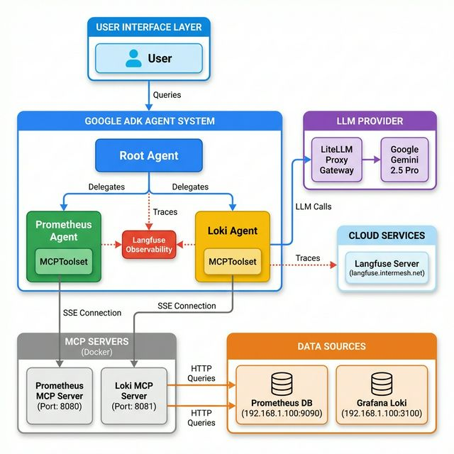

# Visual Architecture Guide

## 🎨 Complete System Architecture



This diagram shows the complete architecture including:
- **User Interface Layer** - Entry point for user interactions
- **Google ADK Agent System** - Root agent with Prometheus and Loki sub-agents
- **LLM Provider** - LiteLLM proxy routing to Gemini 2.5 Pro
- **MCP Servers** - Dockerized servers for Prometheus (8080) and Loki (8081)
- **Data Sources** - Prometheus and Grafana Loki databases
- **Cloud Services** - Langfuse observability platform
- **Observability** - Langfuse traces monitoring all agent operations

---

## 📊 Data Flow Sequence

### Example: User Query for CPU Metrics

```
┌─────────┐
│  User   │  "Show me CPU usage metrics"
└────┬────┘
     │
     ↓
┌─────────────────┐
│   Root Agent    │─────────────────┐
└────┬────────────┘                 │
     │ Delegates                    │ Start Trace
     ↓                              ↓
┌────────────────────┐         ┌──────────┐
│ Prometheus Agent   │────────→│ Langfuse │
└────┬───────────────┘ Log      └──────────┘
     │
     │ Request Tool
     ↓
┌──────────────────────┐
│ Prometheus MCPToolset│
└────┬─────────────────┘
     │ SSE Connection + PromQL
     ↓
┌───────────────────────────┐
│ Prometheus MCP Server     │
│ (Docker: localhost:8080)  │
└────┬──────────────────────┘
     │ HTTP Request
     ↓
┌─────────────────────────────┐
│ Prometheus DB               │
│ (192.168.1.100:9090)       │
└────┬────────────────────────┘
     │
     │ ← Metric Data Returns ←
     ↓
┌─────────────────┐
│ Formatted       │
│ Response        │
└────┬────────────┘
     │
     ↓
┌─────────┐
│  User   │  "Current CPU usage is 45%..."
└─────────┘
```

---

## 🌐 Network Architecture & Topology

```
╔══════════════════════════════════════════════════════════════╗
║                      LOCAL MACHINE                           ║
╠══════════════════════════════════════════════════════════════╣
║                                                              ║
║  ┌────────────────────────────┐  ┌─────────────────────────┐║
║  │  ADK Agent Process         │  │ Docker Network          │║
║  │  (Python)                  │  │ (agent-network)         │║
║  │                            │  │                         │║
║  │  ┌──────────────────┐      │  │  ┌────────────────┐    │║
║  │  │  Root Agent      │──────┼──┼─→│ Prometheus MCP │    │║
║  │  └────┬─────────────┘      │  │  │ :8080          │    │║
║  │       │                    │  │  └────────────────┘    │║
║  │   ┌───┴────┐               │  │                        │║
║  │   ↓        ↓               │  │  ┌────────────────┐    │║
║  │  ┌────┐  ┌────┐            │  │  │ Loki MCP       │    │║
║  │  │Prom│  │Loki│────────────┼──┼─→│ :8081          │    │║
║  │  │Agt │  │Agt │            │  │  └────────────────┘    │║
║  │  └────┘  └────┘            │  │                        │║
║  └────────────────────────────┘  └─────────────────────────┘║
║         │                                    │               ║
║         │ LLM Calls (HTTPS)                 │ HTTP          ║
╚═════════┼════════════════════════════════════┼═══════════════╝
          │                                    │
          ↓                                    ↓
    ┌─────────────────┐            ┌──────────────────────┐
    │ Cloud Services  │            │ Remote Infrastructure │
    │                 │            │ (192.168.1.100)      │
    │ ┌─────────────┐ │            │                      │
    │ │  LiteLLM    │ │            │  ┌──────────────┐   │
    │ │  Gateway    │ │            │  │ Prometheus   │   │
    │ └─────────────┘ │            │  │ :9090        │   │
    │                 │            │  └──────────────┘   │
    │ ┌─────────────┐ │            │                     │
    │ │  Langfuse   │ │            │  ┌──────────────┐   │
    │ │  Server     │ │            │  │ Grafana Loki │   │
    │ └─────────────┘ │            │  │ :3100        │   │
    └─────────────────┘            │  └──────────────┘   │
                                   └──────────────────────┘
```

**Port Configuration:**
- `8080` → Prometheus MCP Server (SSE endpoint: `/sse`)
- `8081` → Loki MCP Server (SSE endpoint: `/sse`)
- `9090` → Prometheus Database
- `3100` → Grafana Loki Database

---

## 🔄 Example Query Flows

### Flow 1: Log Analysis Query

```
INPUT: "Show me recent errors in the auth service"
   │
   ├──→ Root Agent
   │      │
   │      ├──→ Decision: Log Analysis Required
   │      │
   │      └──→ Delegate to Loki Agent
   │             │
   │             ├──→ Constructs LogQL Query
   │             │    Query: {service="auth"} |= "error"
   │             │
   │             ├──→ Loki MCPToolset (localhost:8081/sse)
   │             │      │
   │             │      └──→ Loki MCP Server
   │             │             │
   │             │             └──→ Grafana Loki (HTTP)
   │             │                    │
   │             │                    └──→ Returns Log Entries
   │             │
   │             └──→ Formats Results
   │
   └──→ OUTPUT: "Found 3 authentication errors:
                 - 2026-02-12 01:00:15 - Invalid token
                 - 2026-02-12 00:58:32 - Session expired
                 - 2026-02-12 00:45:19 - User not found"

OBSERVABILITY: All steps traced by Langfuse ✓
```

### Flow 2: Metrics Query

```
INPUT: "What's the memory usage?"
   │
   ├──→ Root Agent
   │      │
   │      ├──→ Decision: Metrics Query Required
   │      │
   │      └──→ Delegate to Prometheus Agent
   │             │
   │             ├──→ Constructs PromQL Query
   │             │    Query: node_memory_MemAvailable_bytes
   │             │
   │             ├──→ Prometheus MCPToolset (localhost:8080/sse)
   │             │      │
   │             │      └──→ Prometheus MCP Server
   │             │             │
   │             │             └──→ Prometheus DB (HTTP)
   │             │                    │
   │             │                    └──→ Returns Metric Data
   │             │
   │             └──→ Calculates & Formats Results
   │
   └──→ OUTPUT: "Current memory usage: 4.2GB / 16GB (26.25%)
                 Available memory: 11.8GB"

OBSERVABILITY: All steps traced by Langfuse ✓
```

---

## 🔧 Component Interaction Matrix

| Component | Interacts With | Protocol | Purpose |
|-----------|---------------|----------|---------|
| **User** | Root Agent | ADK API | Send queries, receive responses |
| **Root Agent** | Prometheus Agent | Function Call | Delegate metrics queries |
| **Root Agent** | Loki Agent | Function Call | Delegate log queries |
| **Root Agent** | LiteLLM Gateway | HTTPS | LLM inference requests |
| **Root Agent** | Langfuse | HTTPS | Send traces/observability data |
| **Prometheus Agent** | Prometheus MCPToolset | Python SDK | Access Prometheus tools |
| **Loki Agent** | Loki MCPToolset | Python SDK | Access Loki tools |
| **Prometheus MCPToolset** | Prometheus MCP Server | SSE | Real-time tool execution |
| **Loki MCPToolset** | Loki MCP Server | SSE | Real-time tool execution |
| **Prometheus MCP Server** | Prometheus DB | HTTP | Execute PromQL queries |
| **Loki MCP Server** | Grafana Loki | HTTP | Execute LogQL queries |
| **LiteLLM Gateway** | Google Gemini | HTTPS | Route LLM requests |

---

## 📝 Configuration Summary

### Environment Variables (`.env`)

```bash
# LLM Provider
LITELLM_PROXY_API_KEY=sk-hZfJOZ_uKZcA1P3J8YfzzQ
LITELLM_PROXY_API_BASE=https://imllm.intermesh.net

# MCP Server Endpoints
PROMETHEUS_MCP_URL=http://localhost:8080/sse
LOKI_MCP_URL=http://localhost:8081/sse

# Observability
LANGFUSE_SECRET_KEY=sk-lf-9554d001-0685-4e8d-a20e-368a5a2ddcee
LANGFUSE_PUBLIC_KEY=pk-lf-60c4a388-9328-4c5b-8e8c-b5448a1b9ec9
LANGFUSE_BASE_URL=https://langfuse.intermesh.net
```

### Docker Configuration (`docker-compose.yml`)

```yaml
services:
  loki-mcp-server:
    image: loki-mcp-server
    container_name: loki-mcp-server
    environment:
      - LOKI_URL=http://192.168.1.100:3100
    ports:
      - "8081:8080"
    networks:
      - agent-network
```

---

## 🚀 Quick Reference

### Start the System

```bash
# 1. Start MCP Servers
docker-compose up -d

# 2. Verify containers
docker ps | grep mcp-server

# 3. Run the agent
adk run hello_agent
```

### Query Examples

| Query Type | Example | Agent Used |
|------------|---------|------------|
| Metrics | "Show CPU usage" | Prometheus Agent |
| Metrics | "What's the memory consumption?" | Prometheus Agent |
| Logs | "Show recent errors" | Loki Agent |
| Logs | "Find authentication failures" | Loki Agent |
| Mixed | "Check system health" | Both agents |

---

## 🎯 Key Benefits

✅ **Modular Design** - Specialized agents for different data sources  
✅ **Observability** - Full tracing with Langfuse  
✅ **Scalable** - Easy to add new agents and data sources  
✅ **Standardized** - MCP protocol for consistent tool access  
✅ **Containerized** - Docker for easy deployment and isolation  
✅ **Production-Ready** - LiteLLM proxy for enterprise LLM access
